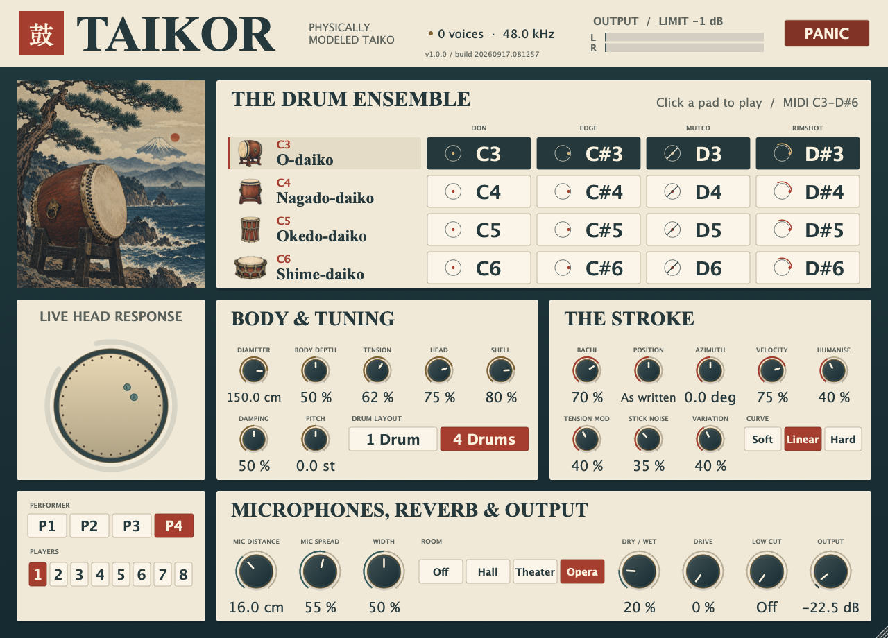

# Taikor

A **physically modeled taiko ensemble instrument** inspired by modern kumi-daiko.
Play four drums and four strokes, with up to eight players per note. Every hit
is synthesized from the drum model; no samples or recordings are loaded.

**VST3 · CLAP · Standalone** on macOS, Windows and Linux · **Audio Unit** on macOS.

<!-- distribution-link-begin -->
**[Download latest distribution](https://github.com/protocodus/virtual-instrument-taikor/actions/runs/34523857119/artifacts/10171089035)** — built from [`a1914ba88eaa`](https://github.com/protocodus/virtual-instrument-taikor/commit/a1914ba88eaa7d76f09dcbee44e58b0c33cc99d9).
<!-- distribution-link-end -->



## Download and install

The download contains all platform packages, an editor screenshot, audio demos
and SHA-256 checksums. Each successful `main` build updates the link above.
GitHub sign-in is required; downloads are retained for 30 days.
[Browse successful builds](https://github.com/protocodus/virtual-instrument-taikor/actions/workflows/nightly.yml?query=branch%3Amain+is%3Asuccess).

| Platform | Formats | Package |
| --- | --- | --- |
| macOS 11+ · Apple Silicon and Intel | VST3, Audio Unit, CLAP, standalone | Universal ZIP and PKG installer |
| Windows x64 | VST3, CLAP, standalone | ZIP |
| Linux x64 | VST3, CLAP, standalone | Tarball |

On macOS, use the PKG installer or copy the bundles from the ZIP. Bundles use
ad-hoc signatures; the installer is unsigned and has no Apple notarization.
On Windows, copy `VST3/Taikor.vst3` to `C:\Program Files\Common Files\VST3`
and `CLAP/Taikor.clap` to `C:\Program Files\Common Files\CLAP`, or run the
standalone executable. The Windows build includes the Visual C++ runtime.
On Linux, copy the VST3 bundle to `~/.vst3` and the CLAP file to `~/.clap`.

## Audio demos

Listen to the instrument's own synthesized performances:

- [The four drums](Docs/audio/02-the-four-drums.wav) — one Don on each drum.
- [The four strokes](Docs/audio/01-stroke-vocabulary.wav) — open, edge, muted and rimshot.
- [Ensemble piece](Docs/audio/25-ensemble-piece.wav) — a phrase across the playing grid.
- [Performer ensemble](Docs/audio/27-performer-ensemble.wav) — repeated P1 layers, then P1–P4.

[All 27 demos](Docs/audio) · [Playing guide](#how-it-is-played) ·
[Controls](#controls) · [Technical details](#technical-details)

## Release history

### 2026-09-11

- Added build numbers to every platform package and the final distribution
  artifact; the download link records the matching build and source commit.
- Added independent family skin and bachi profiles, fixed uneven-head modal
  axes, the shared head/air cavity, and reciprocal shell boundary coupling.
- Added rear-head strokes through **CC18** (0–63 front, 64–127 rear), captured
  per hit including delayed ensemble companions. **CC121** restores the front.
- Updated physical readouts and live state transfer for the shared cavity;
  retained the vintage Japanese editor and existing host parameter IDs.
- Aligned the residual-noise filters with their physical excitation frequencies,
  preventing misplaced noise from overwhelming a drum's body partial.

### 2026-09-09

- **Redesigned the instrument in indigo, ivory and vermilion**, with original
  Japanese woodblock artwork, illustrated drum selectors, a high-contrast
  playing grid and separate body, stroke and output panels. Performance controls remain
  on one screen, with editable values, keyboard focus and host automation preserved.

### 2026-09-08

- **Resolved the head to seventy-six modes** — 152 resonators against the
  former 40 — with the bachi contact still solved against the calibrated
  twenty entries and the further fifty-six driven one-way beneath the
  unchanged statistical continuum. Their share sits 20–25 dB under a Don on
  the ō-daiko; the sample peak of a full Don moves by 0.7 dB and the 500 ms
  RMS by under 0.1 dB.
- **Gave soft bachi a felt contact law.** Below Bachi Hardness 50 % the
  contact exponent rises from the Hertz 1.5 to 2.5, with the stiffness pinned
  so a neutral stroke keeps its contact time; a felt beater's contact now
  shortens as *v^−0.43* rather than *v^−0.2*. The hard bachi the family is
  played with is untouched.
- **The far head reaches the pair by its own path.** On every cavity-coupled
  axisymmetric branch the resonant head's share arrives down the body and
  round the rim, later and more spread, carried as the mode's quadrature
  residue.
- **Each resolved entry carries its own tension ripple** beside the shared
  follower, so a mode is stiffened by its own motion. A uniform ripple was
  measured to pump the nagadō-daiko's (0,1) and (2,1) modes parametrically
  and was not kept.
- **Ensemble companions are distinct drums.** Above Variation 0 each player
  gets its own head tension, hide, shell and damping offsets, hashed from its
  seat.
- **Every one of the five sits behind a review switch**
  (`TaikoEngine::setRealismFeatures`); with all five off the engine renders
  sample-identically to the previous release. They ship on: the listening
  test recorded in `Docs/decisions.md` chose all five together.
- **The panel is readable and shorter.** The control decks sit on a
  translucent washi wash, every label and readout is larger, Velocity Curve
  is a three-position Curve switch, Ensemble Size an eight-position Players
  switch, and Resonant Head, Air Coupling and Shell Resonance stay host
  parameters without a knob. Each grid pad shows its strike map beside its
  note name, both sized to the pad.
- **Added two switched candidates for the wood and the hide**, both off: the
  head's boundary shear at the rim driving the shell on every stroke, and a
  per-drum hide thickness variation replacing the single 5.1-cent split. The
  first fails its own screen against real captures and the reason is recorded;
  neither has been to a listening test.
- **Two candidates for the head's noise character were rendered and rejected
  by ear**, and stay in `TaikoEngine::setRealismFeatures` switched off: the
  continuum handed off above the whole resolved bank, and the bachi contact
  solved against every resolved entry. See `Docs/decisions.md` for what the
  measurements said and why the listening test overruled them.

### 2026-09-06

- **Added CLAP for macOS, Windows and Linux**, alongside VST3, the macOS Audio
  Unit and the standalone instrument.

<details>
<summary>Earlier changes</summary>

### 2026-09-05

- **The upper spectrum follows the solved strike force.** Causal modal-response
  integration replaces nominal Hertz spectral shading and positive-only noise
  injection. Sustained contact can now cancel high-mode excitation. The accepted
  tension/bending weighting remains, while the attack and upper tail can change
  in existing sessions. The reference impulse still anchors overall voicing.

- **Removed the extra airborne click.** The hit now reaches the output through
  the contact-driven drum, its statistical upper spectrum and the applicable
  tack source. The separate differentiated-force layer and its unsupported
  patch-size filter were removed after the user preferred the comparison
  without them. This changes the attack of existing sessions.

- **Corrected the high-mode statistical impulse response.** Relative band
  levels now integrate modal population and force-to-displacement response
  using each head's tension/bending dispersion. The original crossover band,
  filter topology and output protection remain in place; higher bands change
  level, so existing sessions can sound different above the resolved modes.
  This is a model correction, not a recording-derived calibration.

- **Added Ensemble Size and Ensemble Variation.** Each played row can trigger
  1–8 independent drum models with up to 30 ms of companion timing spread and
  bounded strike-placement scatter. The lead stays on the MIDI timestamp,
  all members share one protected output stage, and Size 1 retains the solo
  behavior. The two controls append host parameters without moving existing
  automation; older sessions load with Size 1.

- **Kept repeated hits alive at Humanise 0.** A small impact-speed and
  contact-duration floor now varies successive strokes even with Stick Noise
  at zero. Performer identities also vary this tightest gesture, contact noise
  is reseeded on every hit, and the sequence uses both halves of its 64-bit
  stroke counter. Reset still reproduces the same performance; Panic and
  natural silence preserve the advancing sequence. Existing sessions that
  relied on machine-identical Humanise-zero hits now receive this variation.
  Selected as **B by ear** in the level-matched
  [repeated-stroke comparison](Docs/decisions.md#2026-09-05--repeated-strokes-retain-contact-variation).

### 2026-08-19

- **Gave the wooden shell a perspective.** Mic Distance moved the head's near
  field and the head's continuum but left the body at one fixed level, so
  backing the pair off thinned the drum around a shell that never receded. A
  ring mode is now read the way a membrane mode is — an evanescent term at its
  own circumferential wavenumber `n/R` over the wall-to-capsule path, plus the
  same proximity lift and propagating share — taken as a ratio against each
  drum's own capsule distance at the factory Mic Distance, so every factory
  preset renders exactly as it did. At 40 cm the ō-daiko's lowest ring mode is
  3.6 dB down and the okedo's 16.0 dB, while the top of either bank moves under
  a decibel. Chosen by ear from a six-way listening test; see
  [Docs/decisions.md](Docs/decisions.md).
- **Adjudicated fifteen proposed acoustic and performance mechanisms** against
  the shipping engine; none was released. Two README claims were corrected in
  the process: Body Depth *does* move the decay of the axisymmetric pair, so
  what the model lacks is a loss belonging to the enclosed *air* rather than
  authority over the tail; and that missing loss factor is 2.8e-4 to 6.6e-4 by
  Kirchhoff's boundary-layer result, worth at worst 1.49 % of the decay over
  four octaves, eleven Body Depths and three Air Couplings.

### 2026-08-17

- **Removed the unsupported one-way shell copy from head-only Don, Ka and Tsu.**
  Their normal contact force already loses energy through the resolved
  shell-dependent boundary, but it was also being sent after the reciprocal
  solve into six shell oscillators that contributed no sensing or compliance.
  On the light okedo that fixed 191 Hz ladder overwhelmed the head by 26.8 dB
  on Ka. The wooden bank now belongs to Don Rim alone; okedo Ka falls by about
  20 dB over 5–30 ms and Tsu by about 10 dB. No replacement EQ, radiation
  scalar or fitted gain was added.
- **Preserved the unresolved head's calibrated RMS** when live Pitch, Tension
  Mod or a structural rebuild moves a continuum filter. Ordinary attack stretch
  moves only 0.009–0.016 dB, while two-octave automation no longer inherits up
  to several decibels of passband gain.
- **Made the zero-azimuth analytic observer rank the detuned cosine pole** the
  renderer actually builds rather than its unsplit parent. The four sounding
  pitches now close on exact heard octaves at 59.747 / 119.495 / 238.990 /
  477.979 Hz.

### 2026-08-16

- **Corrected the analytic `sin^1.5` Hertz reference impulse** from an
  unrelated `sqrt(sin)` integral to 1.7480383695280799, then bounded each
  contact's stochastic-continuum observation by the direct rigid-target
  Hunt–Crossley squared-force integral. A factory chū Don remains uncapped at
  about 0.953 of the limit; the hostile shime Don's roughly 446× request is
  bounded, while 80–500 ms shime tails and dense-gesture onsets stay intact.
- **Stopped treating the two heads as coincident radiators.** The axisymmetric
  loss now includes their finite body-depth separation through
  `b² + r² + 2br·sinc(ωL/c)`, preserving the former zero-depth limit and a
  non-negative passive power. The factory shime's opposing lower branch moves
  from 1.685 to 0.851 s T60 without changing its first-80-ms hit level.
- **Gave each axisymmetric membrane pair its own finite-column cavity factor**
  instead of reusing the (0,1) result. The factory higher upper branches move
  down by 12.2 / 4.8 / 1.3 cents while the tuned pair is unchanged, and the
  higher solves run once on the octave search's winning drum, adding no
  per-sample work.
- **Gave each unresolved-head octave a wavelength-dependent microphone-distance
  law.** All five bands keep their exact factory-position level, while a
  3–40 cm move now attenuates the factory ō-daiko's band targets by roughly
  9.1 / 14.2 / 18.6 / 21.1 / 22.1 dB from low to high instead of one flat gain.
- **Removed the scalar observer's false omnidirectional floor** from every
  non-axisymmetric head mode: the angular factor now multiplies the propagating
  term as well as the local field, so all 32 resolved multipole resonators and
  the pitch readout go to zero on their nodal azimuths.
- **Added explicit polar strike placement.** A ±180° Strike Azimuth parameter
  reaches modal drive, reciprocal contact and the two-microphone observer, with
  CC16/CC17 for sample-accurate absolute azimuth and radial overrides and CC121
  to clear both. At the 0° default the former angle-jitter expression is
  retained exactly.
- **Removed Strike Position's clamped dead travel:** each articulation now
  spends its full bipolar range moving continuously between its own written
  position and the same centre/rim endpoints it already reached.
- **Made structural automation continuous in physical two-head coordinates.**
  Axisymmetric rebuilds preserve batter/rear displacement, velocity and pending
  force while redistributing a live Tsu loss in the new eigenbasis; a bachi
  still touching the head receives matching sensing and force projections.
- **Removed two synthetic-noise shortcuts from the hit.** The unresolved head
  now uses the same Hertz contact spectrum as the resolved modes instead of a
  one-pole brightness law, and the direct airborne click differentiates only
  the solved normal force rather than differentiating roughness a second time
  into a flat Nyquist shelf.
- **Removed three sources of cheap hit noise** without lowering the drum's
  resonant object: rope-laced okedo and shime no longer emit byō tack chatter,
  the remaining tacked drums confine it to 2.6–9 kHz with exact host-rate
  normalisation, and Humanise scatters equal bounded radial and tangential
  distances instead of swinging edge strokes through metre-scale arcs.
- **Added four stable Performer identities** for honest multi-instance
  ensembles. P2–P4 salt only the variation Humanise already owns — contact
  point, speed and duration — so layered instances change the performed
  resonant hit rather than merely adding noise. P1 preserves the established
  sequence at introduction; no identity hides a
  pitch, drum-size or gain offset.
- **Appended the automatable Velocity Curve** as the 25th host slot, without
  moving any established parameter ID or automation index. `pow(v, exp2(c))`
  gives Soft 100 / Linear / Hard 100 controller response; Linear takes an exact
  identity branch and is the default. It calibrates the player and controller
  before Velocity Depth rather than inventing an acoustic effect.
- **Added a dependency-free controlled-capture inventory preflight.** Its
  strict TSV contract checks synchronized calibrated channels, one complete
  3×3×2 mobility core, the low-speed Ka/Tsu/Rim strike matrix, held-palm and
  simultaneous head/hoop metadata, repeated measured-speed bins, matching
  fixture state, raw traction maps, and bachi identity, mass and tip
  metrology. It validates acquisition coverage only — it neither reads samples
  nor blesses the current contact discontinuities.

</details>

---

## Technical details

The panel pairs original Japanese woodblock artwork with indigo framing and
opaque ivory control surfaces. A coastal print and four drum studies sit beside
the playing grid; labels and values stay clear of the artwork. **Body & Tuning**,
**The Stroke** and **Microphones & Output** group the continuous controls.
**Performer** has four switch positions, **Drum Layout** two, **Curve** three and
**Players** eight. Resonant Head, Air Coupling and Shell Resonance remain
host parameters without panel controls. Performance controls fit on one screen
from 1024 × 704 to 1472 × 1012. The images were generated with the built-in
imagegen tool; [prompts and provenance](Assets/artwork-provenance.json) are
included with the assets.

Taikor loads no samples, replays no recording, and emulates no particular
branded instrument. Every stroke is solved from a struck circular membrane: the
head's modes come from the zeros of a Bessel function, the air hanging off it
lowers them, the enclosed body couples the two heads together, the wooden body
shapes the head at its boundary, a hoop strike wakes the shell's ring modes, and
a dynamic Hertzian bachi contact exchanges force with whatever the head is
already doing.

Change the diameter and the pitch moves as one over the radius. Change the head
material and the skin's mass, stiffness and loss change together around its
family profile. The cavity couples radial shapes across both heads, producing
mixed head and air resonances.

### How it works

#### Cultural context and real recordings

The drum families are traditional, while this combination is a **modern concert
ensemble design**. Taiko Center dates Daihachi Oguchi's kumi-daiko approach to
1951 and describes complementary shime and nagadō roles. Taikor does not
reconstruct one shrine's festival, a Noh/Kabuki ensemble, or an Edo-period kit.
The illustration is contemporary art inspired by historical print aesthetics.
[Taiko Center history](https://www.taiko-center.co.jp/english/history_of_taiko.html).

**Ō-daiko** describes a large drum; **chū-daiko** describes a middle-sized role.
The second voice is now labeled **Nagado-daiko**, the construction it models.
**Okedō-daiko** is stave-built and tensioned; **shime-daiko** covers tensioned
drum types, with this voice inspired by tsuke-shime. Asano lists a 78 cm nagadō
at 2-shaku 6-sun, correcting the former 2.5-shaku description. Its tsuke-shime
outer heads are 34.5–39 cm. Taikor's 30 cm modeled membrane has not been checked
against a measured active span; it must not be presented as that retail head
diameter. The smaller okedō's exact dimensions are likewise a design choice.
[Asano families](https://www.asano.jp/product/),
[nagadō dimensions](https://www.asano.jp/product/3),
[tsuke-shime dimensions](https://www.asano.jp/product/145).

Public acoustic performances for listening and technique comparison:

| Recording | Useful comparison |
| --- | --- |
| [Kodo: Tomohiro Mitome, Ōdaiko](https://www.youtube.com/watch?v=6tdOuNKEsrY) | Large-drum gestures and dynamics; linked by [Kodo's school](https://www.kodo.or.jp/en/kodo_taiko_school/odaiko2023) |
| [Kodo: Uneri, nagadō part](https://www.youtube.com/watch?v=IKZOh9F9ZwA) | The nagadō/miya drum voice |
| [Kodo: Uneri, shime part](https://www.youtube.com/watch?v=-D3Z6kb-K5M) | Shime articulation and rhythmic role |
| [Japan Taiko Association: Michi, katsugi okedō](https://www.youtube.com/watch?v=JXpxHs4O4p4) | Shoulder-carried okedō; a different mounting from the modeled standing drum |
| [Kodo: Uneri, audience-view ensemble](https://www.youtube.com/watch?v=gEmIAAvGiYc) | Ensemble phrasing and balance; this arrangement uses ohira, nagadō and shime |

The part/ensemble links are identified on [Kodo's Uneri page](https://www.kodo.or.jp/en/about_en/kodo-one-earth-music/02uneri);
the katsugi link is identified on the [association's performance page](https://www.taikojapan.com/joint-performance/).
Publisher attribution and links were checked; these recordings have not been
measured against Taikor. Their room, microphones, processing, heads and impact
forces are not controlled. Taikor's own WAV demos are synthesized, and it has
no owned acoustic calibration set. A fair quantitative comparison needs
identified drums and mounting, open/edge/rim/soft strokes, documented mic
positions and gains, repeated dynamics and unprocessed captures. The existing
capture validator checks metadata coverage, not the recorded waveforms or fit.

#### How it is played

**Four drums, four strokes: a 4×4 grid. The octave chooses which drum, and the
bottom four semitones of it choose what is done to that drum.**

That is the whole mapping. There are no keyswitches and no articulation menu.
Sixteen notes, C3 to D♯6, and everything else on the keyboard is silent.

| | C — Don | C♯ — Edge | D — Muted | D♯ — Rimshot |
| --- | --- | --- | --- | --- |
| **C6** Shime-daiko | 84 | 85 | 86 | 87 |
| **C5** Okedo-daiko | 72 | 73 | 74 | 75 |
| **C4** Nagadō-daiko | 60 | 61 | 62 | 63 |
| **C3** Ō-daiko | 48 | 49 | 50 | 51 |

##### The four drums

Each octave uses a different **modeled drum design**. Dimensions, skin properties
and tensions are explicit design priors, not measurements of four identified
instruments. These figures describe a neutral Don at the factory controls and
48 kHz. "Sounds at" names the strongest observed partial after the contact;
"Fundamental" is the lowest batter-excitable axisymmetric mode in the active bank.

| Note | Drum | Head | Body | Batter / rear hide | Shell | Sounds at | Fundamental |
| --- | --- | ---: | ---: | ---: | --- | ---: | ---: |
| C3 | **Ō-daiko** | 150 cm | 1.28 m | 1.10 / 1.02 mm | carved zelkova | 58.8 Hz | 26.7 Hz |
| C4 | **Nagadō-daiko** | 78 cm | 0.94 m | 0.94 / 0.89 mm | carved zelkova | 117.5 Hz | 57.0 Hz |
| C5 | **Okedo-daiko** | 40 cm | 0.50 m | 0.62 / 0.73 mm | light stave-built body | 235.1 Hz | 235.1 Hz |
| C6 | **Shime-daiko** | 30 cm | 0.21 m | 1.20 / 1.12 mm | shallow tensioned-hoop body | 470.2 Hz | 470.2 Hz |

All four use independent natural-hide profiles. Thin okedo hide remains natural
hide; this shime is a thick, tightly tensioned tsuke-shime-inspired design.
Each rear head has its own mass, rigidity, loss and tension ratio. The HEAD
control trims these properties around the family specimen, with an explicit
synthetic-film endpoint at the bottom of its range.

The factory batter tensions are **7.28 / 6.15 / 20.33 / 48.56 kN/m**. They were
chosen in this model to put the default heard pitches on octaves while keeping
the stated dimensions. They are not measured universal family values. Tacked
heads are normally tensioned during manufacture or reheading; rope- or
bolt-tensioned drums allow adjustment. Taikor's continuous tension and pitch
controls also allow settings outside ordinary construction practice.

The two pitch columns differ because the enclosed air couples several radial
head shapes and axial air coordinates. A large drum can be heard at a
non-axisymmetric partial above its lowest mode. Moving the stick changes which
shapes are excited; changing the microphones changes which are observed. The
readout follows that audible result.

Geometry and tension are not recomputed from whichever partial happens to be
loudest. AIR, microphone placement and strike position therefore cannot silently
resize a drum or drive a tuning search into a clamp. The stated heard octaves
apply at the factory settings. Away from them, the strongest partial can change,
and physical stiffness and air coupling can change the intervals.

| Physical property | Ō-daiko | Nagadō-daiko | Okedo | Shime |
| --- | ---: | ---: | ---: | ---: |
| Body depth ÷ diameter | 0.85 | 1.20 | 1.25 | 0.70 |
| Batter hide, kg/m² | 1.10 | 0.94 | 0.62 | 1.20 |
| Rear hide, kg/m² | 1.02 | 0.89 | 0.73 | 1.12 |
| Head stiffness *B* (×10⁻⁴) | 1.04 | 2.85 | 0.86 | 5.07 |

The thick shime's bending stiffness and high tension are independent properties.
The okedo's lighter shell and thinner batter head give it a different contact
response and energy exchange with the rim. Fixed spatial imperfections rotate
and split each non-axisymmetric pair consistently; they do not move between hits. The
supported nagado profile has firmer low-frequency mounting loss, so its initial
coupled boom decays before the sustained body tone. This is an explicit voicing
prior, not a measured claim about all stands.

##### The four strokes

| Note | Stroke | Where the stick lands | What it is |
| --- | --- | ---: | --- |
| C | Don | 0.15 | Full open stroke, a hand's width in from the middle |
| C♯ | Edge | 0.91 | Out on the head near the edge hardware, thin and cutting |
| D | Muted | 0.20 | Damped centre, the free hand resting on the head |
| D♯ | Rimshot | 0.97 | Head and hoop struck together, the loud accent |

Four, and each of them is a different thing done to the drum rather than a
different amount of the same thing. They come in two pairs, and each pair is
separated by a mechanism rather than by a distance. Don and Muted land five
centimetres apart on a 150 cm head and are nothing like each other, because one
of them has the free hand resting on the hide: Muted's sustain is half of Don's.
Edge and Rimshot land six centimetres apart out by the edge and are nothing like
each other, because one is on the head and the other is on the head and the hoop
at once — on a tacked drum, only Rimshot beats the tack-line preload.

Measured as band levels normalised to each stroke's own loudest band, so that
level cannot stand in for timbre, the closest pair of the four is Don against
Muted at 4.5 dB and the widest is Muted against Rimshot at 18.1 dB.

These are not four presets. Each one is a strike position, a contact stiffness
and a mute state fed into the same model. An Edge stroke is bright because striking the
head at 0.91 of its radius drives the modes that have a circumferential order
and barely moves the axisymmetric ones — which is exactly why it is bright on a
real taiko. Their relative loudness still includes one calibrated articulation
factor, so it is not claimed to fall wholly out of impact speed; that same
factor now also participates reciprocally in the contact, so it is no longer
only a post-solve output trim.

These are four modeled gestures, not four universal traditional stroke names.
In [Uzume Taiko's teaching guide](https://www.uzume.com/sites/default/files/2021-11/Uzume%20Taiko%20Vocabulary%20and%20Resources.pdf),
*don* is a strong head stroke, *tsu* a soft head stroke, *ka* a rim stroke and
*su* a rest. Taikor previously called its edge-of-head sound Ka, its palm-muted
sound Tsu, and its combined head/hoop sound Don Rim. The display now uses
**Edge**, **Muted**, and **Rimshot** to describe those modeled mechanisms.
The legacy internal IDs, MIDI notes and filenames remain compatible. Playing
Don softly is closer to that guide's tsu than adding palm damping is.

Kuchi-shōga differs across traditions and groups. The muted and combined
head/hoop models are expressive extensions, not verified standard techniques
for every included drum. A dedicated wooden-rim-only ka is still absent.

**Velocity** sets the impact speed of the stick, from 0.12 m/s — a tip barely
leaving the head — to 6 m/s. The timbre change that comes with it is not a
separate control, because it is not a separate effect: Hertz contact time falls
as the fifth root of impact speed, so a harder stroke is shorter, brighter and
louder at once.

At the default **Linear** Velocity Curve, MIDI velocity feeds the logarithmic
impact-speed mapping directly. The resulting audio level also depends on the
drum and articulation. The curve calibrates a controller before that physical
map: `v_curve = pow(v, exp2(c))`, where `c` runs from −1 to +1. Soft 100 uses
the square root, Linear is the exact identity, and Hard 100 squares the input.
Both endpoints stay fixed. This lets a light or heavy pad reach the intended
impact-speed range; it is not acoustic magic or another drum-timbre control.

**MIDI CC1** lays a finite palm-sized damping patch on the head. It damps
whatever is still ringing, and it goes on damping while it is held — so a stroke
played with the hand down is a muted stroke. Each mode loses energy according to
the established five-point radial area projection. The two orientations of a
non-axisymmetric pair receive its angular average; exact local, cross-modal palm
damping is not claimed. CC1 directly damps the batter; the reciprocal boundary can then draw energy
from the shell. The airborne tack source remains separate. Release CC1 and the
head is open again.

**Strike Azimuth** rotates each articulation's authored radius around the head.
Humanise adds a small two-dimensional scatter around that authored polar point.
Its radial and tangential components are each bounded to the same distance on
the head, so an edge hit no longer jumps around most of the circumference merely
because its angular lever arm is long.

Repeated hits retain subtle contact variation even at **Humanise 0**: incoming
bachi speed varies by up to ±0.5% and the Hertz contact-time factor by ±0.4%.
These are performance-control limits, not claimed measurements of a particular
player. The speed difference enters the stick/head collision itself, so hits
still differ with Stick Noise at zero. Contact texture also gets a fresh seed
on each stroke. The contact-time factor scales Hertz stiffness by its −2.5
power, following the existing contact law; the duration estimate and the live
stick/head collision use the same stiffness. This changes the resonant
waveform even when two incoming speeds happen to coincide. Humanise increases
the variation and adds position scatter; zero keeps the authored position
exact. MIDI onset timing and the drum's
resting tuning remain unchanged.

**Performer** gives that existing Humanise variation one of four stable
identities, P1–P4. To build an ensemble, layer two to four Taikor instances on
the same MIDI part and choose a different Performer in each. The instances then
make distinct, repeatable contact gestures instead of four phase-locked copies.
Performer does not detune, resize or re-level the drum: it only salts the
position, impact-speed, contact-time and stochastic choices in the gesture.
The identities remain distinct at Humanise zero. Choose the identity before
playback. A UI change applies to new hits, while an already-ringing physical
tail keeps its existing identity until
it retires or the engine is cleared by panic or reset.

Variation follows a deterministic stroke sequence rather than wall-clock
randomness. Consecutive hits, including hits after silence or Panic, advance
that sequence. Reset or preparing playback starts it again, so the same MIDI
performance can be rendered reproducibly at different buffer sizes.

**Ensemble Size** assigns 1–8 independently ringing drums to each played row.
At 1 it preserves the solo instrument. At 8, a Don on the ō-daiko row strikes
eight ō-daiko models; playing all four rows can leave 32 drums ringing. Each
player has its own stick/head contact, resonant state and repeatable gesture
identity. The existing Performer setting distinguishes whole ensembles when
layering instances.

Players occupy symmetric positions across the panorama: two sit left/right;
three sit left/centre/right; four sit at 100% left, 50% left, 50% right and
100% right. Larger groups space each side regularly, with a centre player
for odd sizes and no centre player for even sizes. Size 1 keeps the original
stereo microphone image. Size changes move the remaining players with a
15 ms smoothing time constant; removed players' ringing tails retain their
last stage positions.

**Ensemble Variation** adds timing and head-space placement differences to
the companion players. The first player stays on the MIDI timestamp. At
100%, companions arrive up to 30 ms later, with radial and tangential
placement offsets each bounded to 5.5% of the head radius. At 0 there is no
additional timing or placement spread; Humanise and the always-on subtle
contact variation still apply. The default is 40%, and the control has no
effect at Size 1. These are expressive control ranges, not measured ensemble
performance statistics.

Above zero, each companion is also a slightly different drum. Its head
tension moves by up to ±1.8 % of the control, its head and shell material
by ±3 % and its head damping by ±4 %, scaled by Variation and hashed from
the player's seat, so the same seat always plays the same drum. Eight
players of one design used to be one design eight times, phase-locked in
everything but timing; now their partials beat against one another the way
a row of drums does. The offsets are voicing ranges — a quarter-tone of
tension at full Variation — not measured spreads across a real ensemble.

Size sets how many players new notes trigger, and Variation applies to new
notes. Scheduled companion hits retain their captured timing and placement,
and existing tails finish when Size decreases.
Panic cancels pending hits and stops all players. Palm damping and pitch bend
reach every player. The mixed raw microphone signal receives a smoothed
`1/sqrt(Size)` level compensation, then one shared Width, Drive, Low Cut,
Output and limiter path. Width at 50% preserves the stage positions above;
at 0% it sums the whole stage to mono, and above 50% it exaggerates the stereo
image. More players still cost more CPU and tightly aligned
hits can drive the limiter; compensation keeps the increase manageable.
This multiplies independent close-miked drums, without adding shared room
acoustics or sympathetic coupling between them.

**MIDI CC16** is a live absolute azimuth override: 0 / 64 / 127 map to −180° /
0° / +180°. **MIDI CC17** similarly overrides Strike Position: 0 / 64 / 127 map
to Centre 100 / As written / Rim 100 for the selected articulation. Both are
sample-accurate and remain in force for following notes; when a CC and note
share a timestamp, insertion order decides which coordinate that note uses.
**MIDI CC18** selects the struck head: 0–63 front, 64–127 rear. The side is
captured when the note arrives, including for delayed ensemble players, while
the microphones remain in front of the batter.
**CC121 Reset All Controllers** clears both position overrides, restores front
strikes, releases CC1 and centres pitch bend. Taikor does not infer a left
or right hand from note order; send the coordinates before the note they belong
to.

**The pitch wheel** presses the head, which raises its
tension and bends the drum sharp; a stroke that is already ringing bends with
it rather than waiting for the next one.

The controls describe the ō-daiko at C3, and every control is carried across the
family as a trim on all four drums: turn Head Diameter down and the whole set
shrinks, keeping its proportions. **Drum Layout** switches between one design
retuned over the keyboard and the four independently scaled family members —
see below. In **1 Drum**, all four rows retain the reference dimensions and
use explicit front/rear tension retunings. This extended range can exceed what
a real tacked head could withstand. **4 Drums** keeps the dimensions listed in
the family table. Both layouts form heard octaves at the factory settings;
changes to head stiffness or air coupling can change the intervals.

#### Controls

Twenty-five host parameters. Performer is a persisted, non-automatable
performance identity; the other twenty-four are automatable and describe the
drum, stroke, close pair or output rather than adding preset voicing offsets.
Velocity Curve is physically grouped with the stroke controls below but was
appended after Performer as the last host slot, so no established parameter ID
or automation index moved. Resonant Head, Air Coupling and Shell Resonance are
reachable from the host only; the panel no longer carries them.

##### The drum

| Control | Range | Default | What it changes |
| --- | --- | --- | --- |
| Head Diameter | 15–180 cm | 150 cm | The ō-daiko's membrane radius, and a scale factor on the other three drums. Pitch moves as 1/a, and the modal ratios open out as the drum gets smaller because the head's own stiffness stops being negligible |
| Body Depth | 0–100 % | 50 % | Enclosed volume. A shallow body is a stiffer air spring, so it splits the two heads further apart |
| Head Tension | 0–100 % | 62 % | Reference range 1.2–22 kN/m, multiplied by the family’s explicit tension scale. Wave speed is √(T/σ), and the tension is also what the head's stiffness has to compete with, so a slack head is more inharmonic than a tight one |
| Head Material | 0–100 % | 75 % | Thickness/loss trim around each family’s independent natural-hide profile; only the lowest 20% blends toward a synthetic-film endpoint |
| Shell Material | 0–100 % | 80 % | Light laminated ply → dense carved zelkova. Moves the body's ring modes, their Q, and how much the rim absorbs |
| Resonant Head | 0–100 % | 50 % | Far-head tension trim of 0.85×–1.15× around the family's independent rear-tension ratio. Host only |
| Air Coupling | 0–100 % | 85 % | How strongly the enclosed air ties the two heads together. Host only |
| Head Damping | 0–100 % | 50 % | Extra loss on top of the material's own, in the hide and at the rim. At zero the hoop is left free and a large drum will ring for seconds |
| Shell Resonance | 0–100 % | 40 % | Acoustic shell level for direct rim impacts and passive head-to-shell transfer; does not change mechanical mass. Host only |
| Pitch | ±24 st | 0.0 | Musical transposition, applied as head tension |

##### The stroke

| Control | Range | Default | What it changes |
| --- | --- | --- | --- |
| Bachi Hardness | 0–100 % | 70 % | Soft to hard wooden contact compliance around the family’s bachi mass and tip; bare wood retains the Hertz exponent |
| Strike Position | Centre 100 → Rim 100 | As written | Moves continuously from every stroke's own written radius to its existing centre/rim limits. It changes which partial the drum is heard at, and the pitch readout follows it; it does not retune the keyboard |
| Strike Azimuth | −180° → +180° | 0° | Rotates the authored strike point around the head. It changes the cosine/sine modal drive, reciprocal contact projection and close-pair image; Humanise scatters around it |
| Performer | P1–P4 | P1 | Persisted, non-automatable gesture identity for layering instances, including at Humanise 0; choose it before playback. It adds no pitch, drum-size or output-gain offset |
| Velocity Depth | 0–100 % | 75 % | How far MIDI velocity moves the impact speed |
| Velocity Curve | Soft 100 → Hard 100 | Linear | Controller-response calibration applied before Velocity Depth: Soft 100 uses `sqrt(v)`, Linear leaves MIDI velocity unchanged, and Hard 100 uses `v²`. On the panel it is the three-position **Curve** switch at those anchors; a session holding a value between them lights the nearest |
| Tension Mod | 0–100 % | 40 % | Depth of the attack pitch glide, which is the head stretching itself: a hard stroke displaces the hide, a displaced hide is a longer and therefore tighter one, and the drum starts sharp. At 0 the head is treated as linear |
| Stick Noise | 0–100 % | 35 % | Contact texture on the hide, plus tack rattle when a stroke beats the preload on a byō-uchi head |
| Humanise | 0–100 % | 40 % | Per-stroke variation in 2-D hand position, speed and contact time. At 0, position is exact while subtle speed, contact-time and texture differences remain |
| Ensemble Size | 1–8 players | 1 | The eight-position **Players** switch: number of independently ringing copies of each played drum; 1 preserves the solo sound |
| Ensemble Variation | 0–100 % | 40 % | Timing and strike-placement spread among companions, and how far each companion's own hide, tension, shell and damping sit from the lead's; inactive at Size 1 |
| Drum Layout | 1 Drum / 4 Drums | 4 Drums | What a keyboard row represents: one design retuned, or an independently sized family member (see below) |

##### The close pair and the output

| Control | Range | Default | What it changes |
| --- | --- | --- | --- |
| Mic Distance | 3–40 cm | 16 cm | How far the pair stands off the head |
| Mic Spread | 0–100 % | 55 % | How far apart the two microphones sit across the head |
| Stereo Width | 0–100 % | 50 % | Width trim. 50 % is exactly what the pair picked up, and is the default; 0 is an exact mono sum; above 50 % exaggerates the side signal past the measurement |
| Drive | 0–100 % | 0 % | Output-stage saturation, exactly bypassed at 0 |
| Low Cut | Off–500 Hz | Off | Gentle 6 dB/octave output high-pass, after Drive and before Output and the limiter |
| Output | −24 to +6 dB | −22.5 dB | Output level |

Low Cut rolls off low frequencies with a one-pole high-pass, −3 dB at the
selected cutoff. Cutoff changes and the transition to Off use a 15 ms
smoothing time constant to avoid abrupt steps. Off bypasses this added filter exactly; the
existing 12 Hz DC blocker remains in place. Older sessions load with Low Cut
off, and the new parameter follows all existing host parameters to preserve
their automation assignments. Panic and reset clear the filter's tail.

The output keeps substantial headroom for the difference between ghost notes
and hard rim shots. An always-on **−1 dBFS sample-peak limiter** follows stereo
width, Drive, Low Cut and Output, so all output paths receive the same protection. It
reduces both channels together, catches overloads on their first sample, holds
the gain for 1 ms and releases over 80 ms. Below the threshold, with no prior
gain reduction, it passes samples unchanged. It adds no latency, and Panic and
reset clear its state. This replaces the former independent full-scale hard
clips; heavy overload still changes the dynamics. It is a sample-peak safety
limiter, not an oversampled true-peak limiter.

#### The sound engine

The current implementation is described in
[Physical realism: September 9](Docs/physical-realism-2026-09-09.md), with
[construction research and primary sources](Docs/realism-research-2026-09-09.md).
It combines family-specific wooden bachi, independently described skins,
fixed uneven-head modes, a shared two-head/air cavity and reciprocal shell
boundary coupling. **CC18 selects front or rear strikes** without changing the
sixteen-note map.

A circular membrane supplies the spatial basis: Bessel radial shapes and
rotated angular pairs. The lowest four radial shapes on each head share two
axial air coordinates in a generalized mass/stiffness eigensolve. The complete
basis is used for force, contact sensing, strain, loss and observation, and
structural automation maps displacement and velocity through physical head
and air coordinates. Each head also has its own angular bank. Up to 296
resonators, including six shell modes, are retained below the host's cutoff.

The shell is a reduced orthotropic ring model. A signed bearing-edge
projection transfers velocity through a passive reciprocal dashpot; acoustic
shell gain is separate from mechanical mass. The bachi uses family-specific
mass, tip radius and compliance, with the same finite circular footprint for
sensing and applying force. Bare wood remains Hertzian throughout Hardness.

There are still approximations. Only the original twenty spatial entries on
each struck skin and the shared cavity form the reciprocal contact load;
higher entries receive force without feeding back. Five statistical bands
continue the batter's upper spectrum. Rear strikes currently use the resolved
bank and do not inject into that batter-only statistical layer. Exterior
radiation and mounting are reduced models; the shell's directional boundary
mobility, skin constants and observation levels are design priors. None are a
fit to a controlled recording of an identified taiko.

[Earlier technical notes](Docs/technical-notes-2026-09-08.md) preserve the old
formula derivations and listening decisions. Their numerical results describe
the preceding implementation.

### Rendered demo levels

Twenty-seven takes are rendered by [`Tools/RenderDemos.cpp`](Tools/RenderDemos.cpp)
from the same engine the plug-in runs: the four strokes, the four drums, the
whole sixteen-note grid, and the physical controls swept across their ranges.
The main build refreshes the committed set and this level table together.
Render to a fresh directory to review an uncommitted working tree. Legacy
ka/chudaiko filenames remain stable after the display labels changed.

<!-- peaks-table-begin: regenerated by TaikorRenderDemos; edits between the markers are overwritten -->
| File | What it is | Length | Rendered peak | Normalisation |
| --- | --- | ---: | ---: | ---: |
| `01-stroke-vocabulary.wav` | All four strokes on the o-daiko, in keyboard order | 4.2 s | −13.6 dBFS | +10.6 dB |
| `02-the-four-drums.wav` | A Don on each of the four drums: o-daiko, nagado-daiko, okedo, shime | 6.3 s | −24.6 dBFS | +21.6 dB |
| `03-the-playing-grid.wav` | The whole grid: four strokes on each of the four drums | 10.1 s | −11.3 dBFS | +8.3 dB |
| `04-drums-ka.wav` | An edge-of-head stroke on each of the four drums | 3.9 s | −21.5 dBFS | +18.5 dB |
| `05-drums-rim-shot.wav` | A rim shot on each of the four drums | 5.1 s | −10.9 dBFS | +7.9 dB |
| `06-odaiko-phrase.wav` | A phrase on the o-daiko | 10.0 s | −13.3 dBFS | +10.3 dB |
| `07-chudaiko-phrase.wav` | The same phrase on the nagado-daiko | 6.7 s | −15.4 dBFS | +12.4 dB |
| `08-okedo-phrase.wav` | The same phrase on the okedo-daiko | 5.1 s | −10.2 dBFS | +7.2 dB |
| `09-shime-phrase.wav` | The same phrase on the shime-daiko | 4.2 s | −21.9 dBFS | +18.9 dB |
| `10-velocity-dynamics.wav` | One stroke from a ghost note to a full-arm hit | 5.9 s | −22.9 dBFS | +19.9 dB |
| `11-rolls-and-presses.wav` | Press rolls, a played flam and a roll accelerating into a rim shot | 5.4 s | −7.4 dBFS | +4.4 dB |
| `12-bachi-hardness.wav` | Felt beater through to a hard oak bachi | 4.8 s | −22.3 dBFS | +19.3 dB |
| `13-strike-position.wav` | The same stroke walked from centre to rim | 4.6 s | −20.9 dBFS | +17.9 dB |
| `14-head-tension.wav` | Slack head through to fully tacked | 5.5 s | −23.8 dBFS | +20.8 dB |
| `15-head-material.wav` | Thin synthetic film through to thick cowhide | 5.5 s | −25.7 dBFS | +22.7 dB |
| `16-shell-material.wav` | Light laminated staves through to dense carved zelkova, on a rim shot | 5.4 s | −8.1 dBFS | +5.1 dB |
| `17-air-coupling.wav` | Open body through to a fully sealed one | 5.5 s | −22.7 dBFS | +19.7 dB |
| `18-body-depth.wav` | Shallow body through to deep | 5.5 s | −25.0 dBFS | +22.0 dB |
| `19-head-damping.wav` | Open head through to heavily damped | 6.3 s | −27.0 dBFS | +24.0 dB |
| `20-octave-body.wav` | The keyboard as one drum retuned four times, then as the four drums | 7.8 s | −18.4 dBFS | +15.4 dB |
| `21-mic-distance.wav` | The close pair from 3 cm out to 40 cm, on the head and then on the body | 8.5 s | −8.8 dBFS | +5.8 dB |
| `22-mic-spread.wav` | The close pair from coincident to fully opened | 4.5 s | −21.6 dBFS | +18.6 dB |
| `23-hand-damping.wav` | A hand laid on a ringing head, from MIDI CC1 | 6.0 s | −26.1 dBFS | +23.1 dB |
| `24-pitch-wheel.wav` | The wheel pressing the head sharp and flat | 4.3 s | −27.0 dBFS | +24.0 dB |
| `25-ensemble-piece.wav` | A longer piece moving between all four drums of the grid | 10.4 s | −12.6 dBFS | +9.6 dB |
| `26-polar-strikes.wav` | Fixed left, centre and right strikes, then one circuit around the head | 8.6 s | −27.0 dBFS | +24.0 dB |
| `27-performer-ensemble.wav` | Phase-locked P1 copies, then the same phrase layered as P1-P4 | 5.7 s | −13.0 dBFS | +10.0 dB |
<!-- peaks-table-end -->

### Build

The JUCE-free DSP core, tests and demo renderer:

```bash
cmake -S . -B build-dsp -DCMAKE_BUILD_TYPE=Release \
  -DTAIKOR_BUILD_PLUGIN=OFF -DBUILD_TESTING=ON
cmake --build build-dsp --parallel
ctest --test-dir build-dsp --output-on-failure
./build-dsp/TaikorRenderDemos Docs/audio
```

The same build produces `TaikorValidateCalibrationCapture`, the inventory
preflight for the controlled capture described under
[Known gaps](#known-gaps).

The full plug-in requires CMake 3.22+, Git and a C++20 compiler. JUCE 8.0.14
and clap-juce-extensions (including its CLAP submodules) are fetched at pinned
commits during configuration. Local checkouts can be supplied with
`-DTAIKOR_JUCE_PATH=/path/to/JUCE` and
`-DTAIKOR_CLAP_JUCE_EXTENSIONS_PATH=/path/to/clap-juce-extensions`.

```bash
cmake -S . -B build -DCMAKE_BUILD_TYPE=Release -DBUILD_TESTING=ON
cmake --build build --parallel
ctest --test-dir build --output-on-failure
```

On macOS, `./scripts/build-macos.sh` drives the same build through Xcode as a
universal binary and renders the committed editor screenshot while the suite
runs. `./scripts/sign-and-package-macos.sh` produces a ZIP and PKG containing
VST3, Audio Unit, CLAP and the standalone app.

On Windows, use a Visual Studio developer shell with C++ tools and Python 3:

```powershell
cmake -S . -B build-win -A x64 -DBUILD_TESTING=ON "-DCMAKE_EXE_LINKER_FLAGS=/STACK:33554432"
cmake --build build-win --config Release --parallel
ctest --test-dir build-win -C Release --output-on-failure
python scripts/package-windows.py --build-dir build-win
```

The [Main build workflow](https://github.com/protocodus/virtual-instrument-taikor/actions/workflows/nightly.yml)
builds every push to `main`, including merges, and also runs daily or manually.
Download the `taikor-distribution-build-<build number>-<commit SHA>` artifact from a completed run;
it contains the macOS universal ZIP/PKG, Windows x64 ZIP, Linux x64 tarball,
matching screenshot and audio demos under `previews/`, build provenance and
SHA-256 checksums. Individual platform packages remain available if another
platform fails. Distribution artifacts are retained for 30 days.

Package filenames include the version and workflow build number, for example
`Taikor-1.0.0-build-123-Windows-x64.zip`. Local packaging uses `build-local`
when `GITHUB_RUN_NUMBER` is unset. The download link above is updated to the
final combined artifact only after all packages and previews are uploaded.

After all builds and renders succeed, the same workflow refreshes the committed
editor screenshot, all 27 numbered audio demos, and the README's generated
level table together in one bot commit. If `main` has advanced during the build,
that run keeps its downloads and leaves the committed-media refresh to the
newer run. Historical listening previews are preserved.

### Licensing

Original code under the MIT license (`LICENSE`). JUCE is used under its own
terms — see `THIRD_PARTY_NOTICES.md`. No samples, impulse responses,
pretrained weights or third-party preset libraries are included; the
demonstration audio is generated by this repository's own code.
